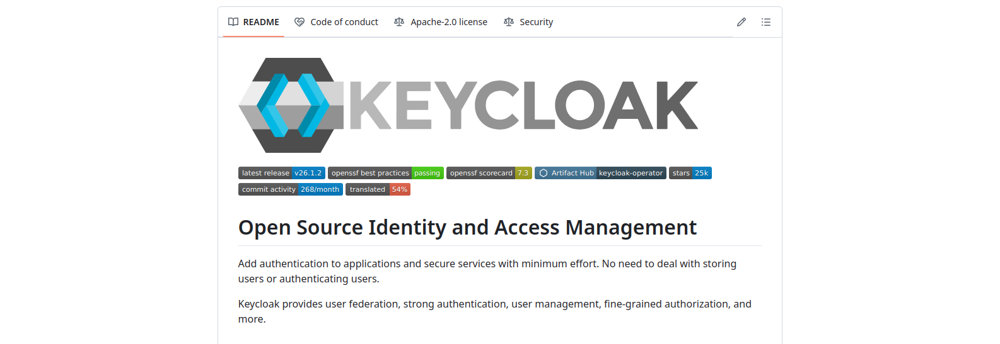
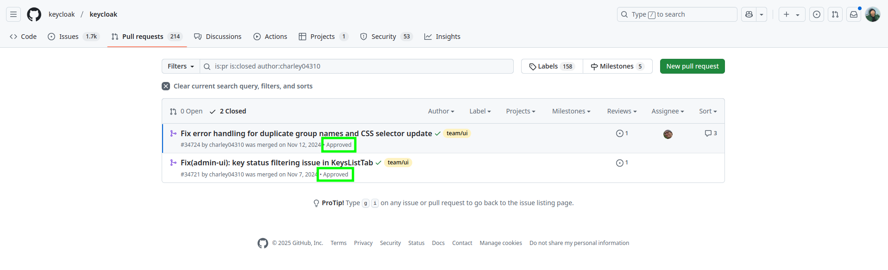
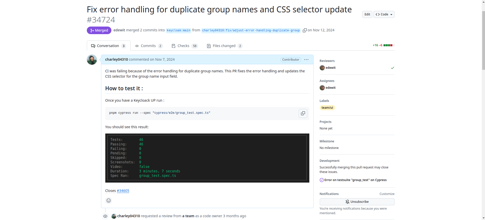
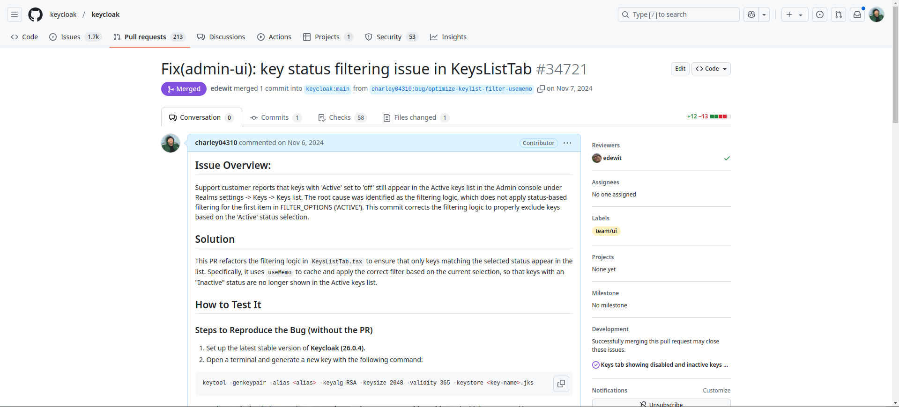
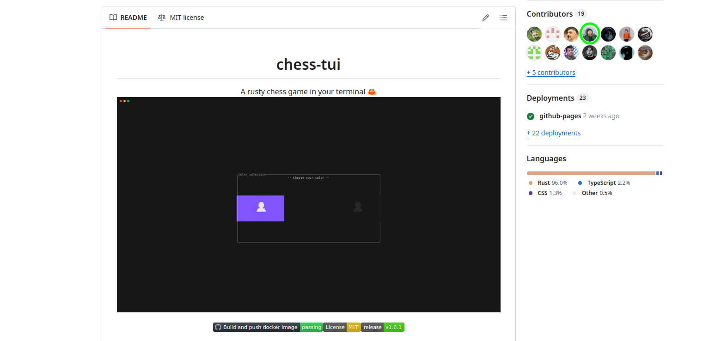
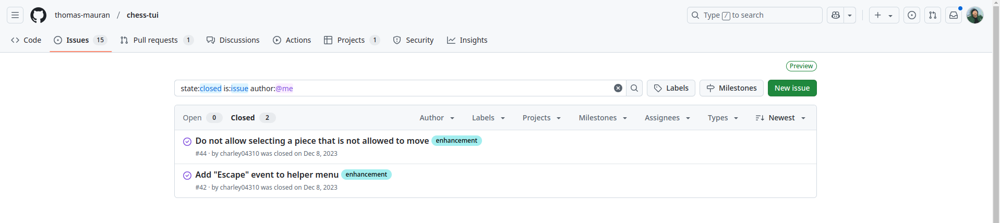
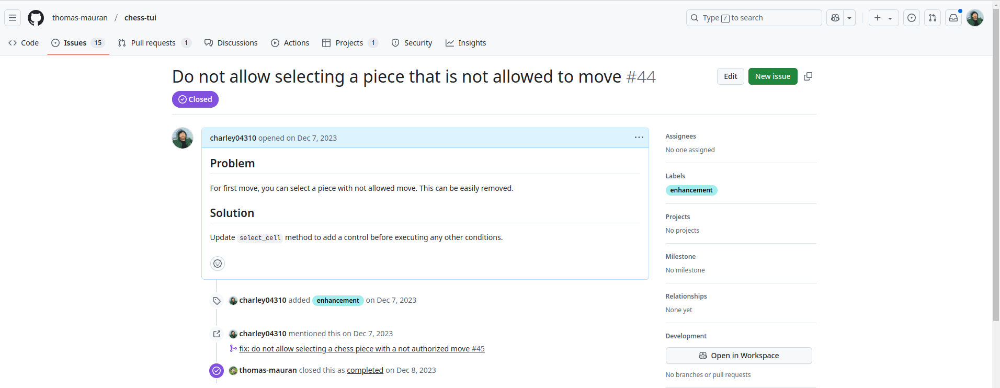
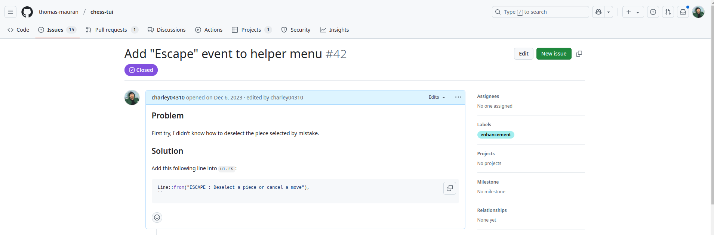
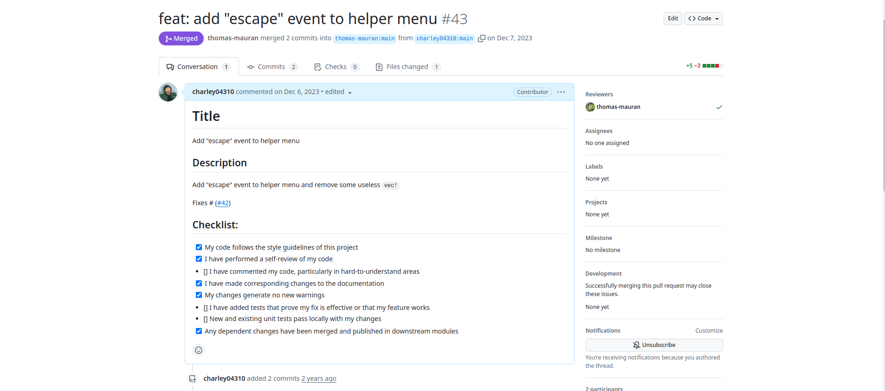

# Mes contributions open source

- Nom : **Geoffroy**
- Prénom : **Charley**
- Classe : **DO5 2025**
- Encadrant : **M. BERRY**
- Github Pages : [charley-opensource](https://charley-opensource.github.io/)

Ce document a pour objectif de présenter mes différentes contribution open source auxquelles j'ai participé. Il est divisé en deux sections principales : Keycloak et Chess-tui game. Chaque section contient une liste de mes contributions, avec une brève description de chaque contribution. Les contributions sont classées par type (BUG, FEATURE, etc.) et sont accompagnées d'une capture d'écran de la PR correspondante.

## Table des matières

>- [Keycloak](#keycloak)
>   * Ma liste de contributions
>      + [🟠 BUG :  Problème de la CI dû à la gestion des doublons de noms de groupe](#-bug-problème-de-la-ci-dû-à-la-gestion-des-doublons-de-noms-de-groupe)
>      + [🟠 BUG : Problème de filtrage de statut clé dans l'onglet KeysListTab](#-bug-problème-de-filtrage-de-statut-clé-dans-longlet-keyslisttab)
>- [Chess-tui game](#chess-tui-game)
>   * Ma liste de contributions
>      + [🟠 BUG : Empêcher la selection d'une pièce qui n'a pas de mouvement possible](#-bug-empêcher-la-selection-dune-pièce-qui-na-pas-de-mouvement-possible)
>      + [🟢 FEATURE  Ajouter une aide contextuelle des commandes en jeu](#-feature-ajouter-une-aide-contextuelle-des-commandes-en-jeu)

## Keycloak

[Keycloack](https://github.com/keycloak/keycloak) est un serveur d'identité et de gestion d'accès open source, qui permet aux applications modernes de sécuriser facilement leurs services. Il est développé par [Red Hat](https://www.redhat.com/fr) et est basé sur des standards ouverts tels que OAuth 2.0, OpenID Connect et SAML. Le projet cumule un total de 25,4k ⭐ (en date du : 20/02/2025) sur GitHub.

### Ma liste de [contributions](https://github.com/keycloak/keycloak/pulls?q=is%3Apr+is%3Aclosed+author%3Acharley04310) 

J'ai eu l'occasion de proposer quelques contributions à ce projet open source. Voici une liste de mes contributions :

#### 🟠 [BUG](https://github.com/keycloak/keycloak/pull/34724) :  Problème de la CI dû à la gestion des doublons de noms de groupe

Cette [pull request (PR)](https://github.com/keycloak/keycloak/pull/34724/files) modifie des tests end-to-end (E2E) et la page des groupes dans l'interface admin de Keycloak. Voici les principales étapes :

1. **Ajout d'un message d'erreur pour les groupes dupliqués** : Une constante `duplicatedGroupErrorMessage` a été ajoutée pour stocker les messages d'erreur spécifiques à la création de groupes en double.

2. **Mise à jour des tests E2E** :
   - Lors de la création de groupes avec des noms en double, les tests ont été mis à jour pour vérifier les nouveaux messages d'erreur définis dans `duplicatedGroupErrorMessage`.
   - Un test précédemment désactivé (skip) a été réactivé pour vérifier la création échouée de groupes avec des noms dupliqués.

3. **Modification de la méthode `assertNotificationCouldNotCreateGroupWithDuplicatedName`** :
   - La méthode a été modifiée pour prendre un second argument `errorMessage`, permettant de vérifier les messages d'erreur spécifiques lors de la création de groupes en double.

En résumé, cette PR améliore la gestion et la vérification des messages d'erreur lors de la création de groupes dupliqués dans les tests E2E et dans la page des groupes de l'interface admin de Keycloak.

#### 🟠 [BUG](https://github.com/keycloak/keycloak/pull/34721) : Problème de filtrage de statut clé dans l'onglet KeysListTab 

Cette [pull request (PR)](https://github.com/keycloak/keycloak/pull/34721/files) corrige un problème de filtrage des clés dans l'onglet `KeysListTab` de l'interface admin de Keycloak. Voici les principales étapes :

1. **Ajout de `useMemo` pour optimiser le filtrage des données :**
   - `useMemo` a été ajouté en plus de `useState` pour améliorer les performances lors du filtrage des données de clés.

2. **Ajout d'un état `filter` pour les options de filtrage :**
   - Un nouvel état `filter` a été introduit, initialisé avec la première option des `FILTER_OPTIONS`.

3. **Utilisation de `useMemo` pour le filtrage des clés :**
   - `useMemo` est utilisé pour filtrer les `keyData` en fonction de l'état `filter` sélectionné.

4. **Modification de l'initialisation de `keyData` et `filteredKeyData` :**
   - Les états `keyData` et `filteredKeyData` sont initialisés à des tableaux vides.

5. **Simplification du composant `SelectFilter` :**
   - Le composant `SelectFilter` a été simplifié pour mettre à jour directement l'état `filter` au lieu de `filteredKeyData`.

En résumé, cette PR améliore l'optimisation et la gestion du filtrage des clés dans la page des clés de l'interface admin de Keycloak.

---

## Chess-tui game

[Chess-tui](https://github.com/thomas-mauran/chess-tui) est un jeu d'échecs simple que vous pouvez jouer depuis votre terminal. Il prend en charge un mode local à deux joueurs, un mode multijoueur en ligne et la possibilité de jouer contre n'importe quel moteur d'échecs compatible UCI. Le projet cumule un total de 600 ⭐ (en date du : 20/02/2025) sur GitHub et a été créé par [Thomas Mauran](https://github.com/thomas-mauran), étudiant en informatique en dernière année de l'école d'ingénieurs Polytech Montpellier.

### Ma liste de [contributions](https://github.com/thomas-mauran/chess-tui/issues?q=is%3Aissue%20state%3Aclosed%20author%3Acharley04310%20) 

J'ai eu l'occasion de proposer quelques améliorations à ce projet open source. Voici une liste de mes contributions :

#### 🟠 [BUG](https://github.com/thomas-mauran/chess-tui/issues/44) : Empêcher la selection d'une pièce qui n'a pas de mouvement possible

Cette [PULL REQUEST](https://github.com/thomas-mauran/chess-tui/pull/45)  modifie la logique de sélection de pièces sur le plateau d'échecs dans l'application Chess TUI. Voici les principales étapes :

Ajout d'une vérification avant la sélection d'une pièce : Du code a été ajouté pour vérifier si la pièce sur la cellule peut se déplacer avant de la sélectionner.

1. **Mise à jour de la méthode de sélection de cellule :**

- L'appel de la  méthode `is_cell_selected` a été mise à jour pour vérifier si la pièce sur la cellule sélectionnée peut se déplacer. Si la pièce ne peut pas se déplacer, la sélection est annulée.

####  🟢 [FEATURE](https://github.com/thomas-mauran/chess-tui/issues/42)  Ajouter une aide contextuelle des commandes en jeu

Cette [pull request (PR)](https://github.com/thomas-mauran/chess-tui/pull/43/files) modifie l'affichage des contrôles de jeu dans le popup d'aide de l'interface utilisateur du jeu d'échecs. Voici les principales étapes :

1. **Modification de l'affichage des contrôles de jeu :**
   - Les lignes utilisant `vec![]` pour formater le texte ont été remplacées par des chaînes de caractères simples.

2. **Ajout de nouvelles instructions de jeu :**
   - Ajout de l'instruction "SPACE_BAR: Select a piece".
   - Ajout de l'instruction "ESCAPE: Deselect a piece".

3. **Corrections mineures de formatage :**
   - Les titres "Game controls:" et "Color codes:" utilisent maintenant des chaînes de caractères simples.

En résumé, cette PR améliore la lisibilité et enrichit les instructions des contrôles de jeu dans le popup d'aide de l'interface utilisateur du jeu d'échecs.

