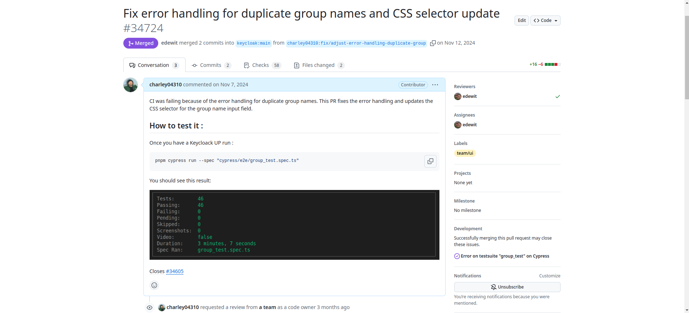
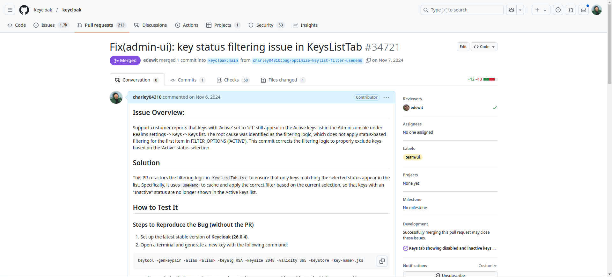

# Welcome to my **open-source contributions page** 🐧🌍

- **👨‍🎓 Full Name**: Charley GEOFFROY 
- **📧 Mail:** [charley.geoffroy@protonmail.com](mailto:charley.geoffroy@protonmail.com)  
- **🏫 School:** [Polytech Montpellier](https://www.polytech.umontpellier.fr/)  
- **🛠️ Specialization:** [Development and Operational Deployment (DevOps)](https://www.polytech.umontpellier.fr/formation/cycle-ingenieur/devops)  
- **🌍 GitHub Pages:** [charley-opensource](https://charley-opensource.github.io/)  

Hey there 👋 and welcome to my **open-source contributions page**! I’m **Charley GEOFFROY**, a final-year engineering student with a deep passion for both space and software development. Currently, I’m working at **Groundspace**, a company near Montpellier that specializes in radio frequency analysis tools for satellite monitoring. This position allows me to merge my love for coding with my fascination for space technology—an exciting journey at the intersection of two incredible fields! 🚀💻

This document aims to present my various open-source contributions. It is divided into two main sections: Keycloak and Chess-tui game. Each section contains a list of my contributions, along with a brief description of each one. Contributions are categorized by type (BUG, FEATURE, etc.) and are accompanied by a screenshot of the corresponding pull request (PR).

## Table of Contents

> 1. [Keycloak](#1-keycloak)  
>    * 1.1 🟠 BUG: CI issue due to duplicate group names
>    * 1.2 🟠 BUG: Key status filtering issue in the KeysListTab
> 2. [Chess-tui game](#2-chess-tui-game)  
>    * 2.1 🟠 BUG: Prevent selecting a piece with no possible moves
>    * 2.2 🟢 FEATURE: Add contextual command help in-game

---

## 1. Keycloak

[Keycloak](https://github.com/keycloak/keycloak) is an open-source identity and access management server that enables modern applications to secure their services easily. It is developed by [Red Hat](https://www.redhat.com) and is based on open standards such as OAuth 2.0, OpenID Connect, and SAML. The project has accumulated a total of **25.4k ⭐** on GitHub (as of 20/02/2025).

#### Keycloak : My [Contributions](https://github.com/keycloak/keycloak/pulls?q=is%3Apr+is%3Aclosed+author%3Acharley04310) List  

I had the opportunity to contribute to this open-source project. Here is a list of my contributions:

### 1.1 🟠 [BUG](https://github.com/keycloak/keycloak/pull/34724): CI Issue Due to Duplicate Group Names 

This [pull request (PR)](https://github.com/keycloak/keycloak/pull/34724/files) improves end-to-end (E2E) tests and the groups page in the Keycloak admin interface. Here are the key steps:

1. **Added an error message for duplicate groups:**  
   - A `duplicatedGroupErrorMessage` constant was introduced to store specific error messages for duplicate group creation.  

2. **Updated E2E tests:**  
   - Tests were modified to check the new error messages when attempting to create duplicate groups.  
   - A previously skipped test was re-enabled to verify failed creation attempts for duplicate group names.  

3. **Modified `assertNotificationCouldNotCreateGroupWithDuplicatedName` method:**  
   - The method was updated to take a second argument, `errorMessage`, to validate error messages for duplicate group names.  

---

### 1.2 🟠 [BUG](https://github.com/keycloak/keycloak/pull/34721): Key Status Filtering Issue in the `KeysListTab`  

This [pull request (PR)](https://github.com/keycloak/keycloak/pull/34721/files) fixes an issue with key filtering in the `KeysListTab` of Keycloak’s admin interface. Key improvements:

1. **Added `useMemo` for optimized filtering:**  
   - `useMemo` was introduced alongside `useState` to improve filtering performance.  

2. **Introduced a `filter` state for filtering options:**  
   - A new `filter` state was added, initialized with the first option in `FILTER_OPTIONS`.  

3. **Used `useMemo` for key filtering:**  
   - `useMemo` now filters `keyData` based on the selected `filter` state.  

4. **Updated `keyData` and `filteredKeyData` initialization:**  
   - These states are now initialized as empty arrays.  

5. **Simplified the `SelectFilter` component:**  
   - It now directly updates the `filter` state instead of modifying `filteredKeyData`.  

---

## 2. Chess-tui Game

[Chess-tui](https://github.com/thomas-mauran/chess-tui) is a simple chess game playable directly in the terminal. It supports local two-player mode, online multiplayer, and the ability to play against any UCI-compatible chess engine. The project has accumulated **600 ⭐** on GitHub (as of 20/02/2025) and was created by [Thomas Mauran](https://github.com/thomas-mauran), a final-year computer science student at Polytech Montpellier.

#### Chess-tui : My [Contributions](https://github.com/thomas-mauran/chess-tui/issues?q=is%3Aissue%20state%3Aclosed%20author%3Acharley04310) List  

I had the opportunity to contribute improvements to this open-source project. Here is a list of my contributions:

### 2.1 🟠 [BUG](https://github.com/thomas-mauran/chess-tui/issues/44): Prevent Selecting a Piece with No Possible Moves

This [pull request (PR)](https://github.com/thomas-mauran/chess-tui/pull/45) fixes the piece selection logic in Chess TUI. Key changes:

1. **Added a verification before selecting a piece:**  
   - Code was added to check whether the selected piece can move before allowing its selection.  

2. **Updated cell selection method:**  
   - The `is_cell_selected` method was updated to validate if the selected piece has valid moves. If not, the selection is canceled.  

---

### 2.2 🟢 [FEATURE](https://github.com/thomas-mauran/chess-tui/issues/42): Add Contextual Command Help In-Game 

  

This [pull request (PR)](https://github.com/thomas-mauran/chess-tui/pull/43/files) improves the in-game help popup by enhancing the display of game controls. Key updates:

1. **Modified the display of game controls:**  
   - `vec![]` formatted text was replaced with simple string literals.  

2. **Added new game instructions:**  
   - Added "SPACE_BAR: Select a piece".  
   - Added "ESCAPE: Deselect a piece".  

3. **Minor formatting corrections:**  
   - Titles such as "Game controls:" and "Color codes:" now use simpler string formats.  

 

In summary, this PR improves readability and enhances the game control instructions in the help popup.

